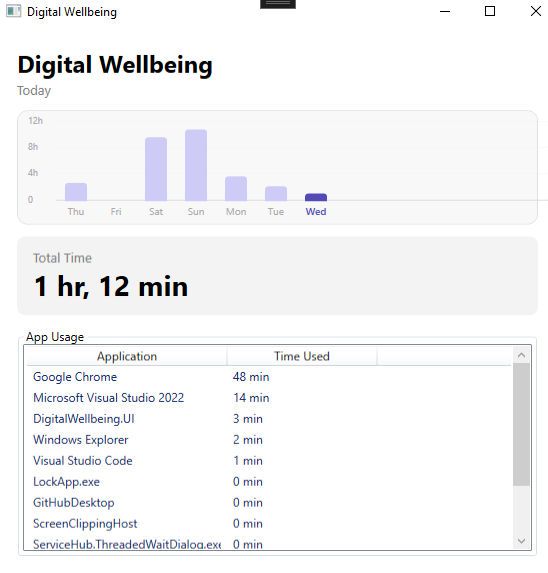

# Digital Wellbeing

A Windows desktop screen time tracker built with C# and WPF. Runs silently in the background, tracks which applications you use and for how long, and presents a clean dashboard with a 7-day usage history.

---

## Features

- **Automatic tracking** — starts on Windows boot, runs silently without any window
- **Per-app usage** — records time spent in each application, identified by friendly name where available
- **7-day bar chart** — clickable daily bars let you browse historical usage at a glance
- **Live dashboard** — refreshes every 5 seconds while open
- **Single-instance enforcement** — only one tracker process runs at a time 
- **SQLite storage** — all data stored locally in `%LocalAppData%\DigitalWellbeing\DigitalWellbeing.db`

---

## Project Structure

```
DigitalWellbeing/
├── DigitalWellbeing.Core/          # Shared models, services, database
│   ├── Data/
│   │   └── DatabaseInitializer.cs  # SQLite schema creation
│   ├── Models/
│   │   ├── AppUsage.cs             # Per-app usage record
│   │   └── DailySummary.cs         # Aggregated daily totals
│   └── Services/
│       ├── AppUsageService.cs      # Read/write app usage records
│       └── DailySummaryService.cs  # Generates daily summaries
│
├── DigitalWellbeing.Tracker/       # Background tracking process
│   ├── Program.cs                  # Entry point, mutex, startup registration
│   ├── AppTracker.cs               # Core tracking loop (1s timer)
│   ├── Win32Api.cs                 # P/Invoke for foreground window detection
│   └── StartupManager.cs          # Registry startup entry management
│
└── DigitalWellbeing.UI/            # WPF dashboard
    ├── App.xaml / App.xaml.cs      # App entry, DB initialization
    ├── MainWindow.xaml             # Shell window
    └── Views/
        ├── DashboardView.xaml      # Main UI: chart + usage list
    └── ViewModels/
        ├── BaseViewModel.cs        # INotifyPropertyChanged base
        ├── DashboardViewModel.cs   # Dashboard logic, week bar calculation, DayBarItem model
        └── RelayCommand.cs         # ICommand implementation for button bindings
```

---

## Architecture

The solution is split into two independent executables that share a common data layer:

```
DigitalWellbeing.Tracker  ──►  SQLite DB  ◄──  DigitalWellbeing.UI
   (background process)      (local file)         (WPF dashboard)
```

**The Tracker and UI are fully decoupled.** The UI never starts or depends on the Tracker — it only reads from the shared database. The Tracker registers itself in the Windows registry to start on boot and runs indefinitely.

---

## Getting Started

### Prerequisites

- Windows 10 or later
- [.NET 8 SDK](https://dotnet.microsoft.com/download/dotnet/8)
- Visual Studio 2022 (recommended) or the `dotnet` CLI

### Build & Run

1. Clone the repository:
   ```bash
   git clone https://github.com/your-username/DigitalWellbeing.git
   cd DigitalWellbeing
   ```

2. Open `DigitalWellbeing.sln` in Visual Studio, or build via CLI:
   ```bash
   dotnet build
   ```

3. **Start the Tracker** (run once — it will self-register for future boots):
   ```bash
   dotnet run --project DigitalWellbeing.Tracker
   ```

4. **Launch the UI**:
   ```bash
   dotnet run --project DigitalWellbeing.UI
   ```

> After the first run, the Tracker starts automatically on every Windows login. You only need to launch the UI manually to view your data.

---

## Data Storage

All data is stored locally — nothing leaves your machine.

| Location | Path |
|---|---|
| Database | `%LocalAppData%\DigitalWellbeing\DigitalWellbeing.db` |

Two tables are used:

- **`AppUsage`** — one row per app per day, storing total seconds used
- **`DailySummary`** — one row per day with aggregated totals and a JSON breakdown, updated every 60 seconds by the Tracker

---

## How Tracking Works

The Tracker runs a 1-second timer. On each tick it:

1. Calls `GetForegroundWindow()` via Win32 API to identify the active window
2. Resolves the process to a friendly name (`FileVersionInfo.FileDescription`) or falls back to the process name
3. Accumulates time while the app stays in focus
4. Writes to the database when the active app changes, or when the Tracker shuts down
5. Handles midnight date rollover cleanly by flushing the current session before continuing

---

## Known Limitations

- Tracking is per-process, not per-website or per-document
- The Tracker must be running for data to be recorded — gaps exist if the machine was off or the process was killed
- Applications that frequently change their process name or use system processes may appear under a generic name

---
## Screenshots


---
## License

MIT License. See [LICENSE](LICENSE) for details.
